### 🔄 The Complete Automation Loop

```mermaid
graph TB
    A[📧 Performance Data] -->|Ingestion| B[🧠 AI Analysis]
    B -->|Optimization| C[📅 Smart Scheduling]
    C -->|Generation| D[✍️ Caption Creation]
    D -->|Deployment| E[🚀 Distribution]
    E -->|Tracking| F[📊 Results Analysis]
    F -->|Learning| A

    style A fill:#4285F4,stroke:#333,stroke-width:2px,color:#fff
    style B fill:#FF6F00,stroke:#333,stroke-width:2px,color:#fff
    style C fill:#00C853,stroke:#333,stroke-width:2px,color:#fff
    style D fill:#669DF6,stroke:#333,stroke-width:2px,color:#fff
    style E fill:#00D9FF,stroke:#333,stroke-width:2px,color:#fff
    style F fill:#9C27B0,stroke:#333,stroke-width:2px,color:#fff
```

<div align="center">



</div>

<br/>

<div align="center">

### **🔄 6-Stage Intelligent Workflow**

</div>

<br/>

<table>
<tr>
<td align="center" width="16.66%">

<br/>

### 📧
### **Ingestion**

<br/>

Automated data collection from Infloww via Gmail API

*Real-time performance metrics*

<br/>

</td>
<td align="center" width="16.66%">

<br/>

### 🧠
### **Analysis**

<br/>

Multi-window ML analysis with recency weighting

*Predictive intelligence*

<br/>

</td>
<td align="center" width="16.66%">

<br/>

### 📅
### **Optimization**

<br/>

Dynamic quota & timing calculations

*Smart scheduling logic*

<br/>

</td>
<td align="center" width="16.66%">

<br/>

### ✍️
### **Generation**

<br/>

AI-powered voice-matched caption creation

*Authentic messaging*

<br/>

</td>
<td align="center" width="16.66%">

<br/>

### 🚀
### **Deployment**

<br/>

Optimized schedule distribution to schedulers

*Seamless handoff*

<br/>

</td>
<td align="center" width="16.66%">

<br/>

### 📊
### **Learning**

<br/>

Performance tracking & continuous improvement

*Self-optimizing system*

<br/>

</td>
</tr>
</table>

<br/>

<div align="center">

```
╔══════════════════════════════════════════════════════════════════════════╗
║                                                                          ║
║   📧 Ingest  →  🧠 Analyze  →  📅 Optimize  →  ✍️ Generate  →           ║
║                                                                          ║
║          →  🚀 Deploy  →  📊 Track  →  🔄 Learn & Improve               ║
║                                                                          ║
╚══════════════════════════════════════════════════════════════════════════╝
```

<br/>

**Every 24 hours, the system executes this complete cycle—learning, optimizing, and improving autonomously**

</div>

<br/>

---

### 📊 How Each Stage Works

<br/>

<table>
<tr>
<td width="50%" valign="top">

#### **📧 Stage 1: Performance Data Ingestion**

**What Happens:**
- Gmail API fetches Infloww performance reports
- Parses Excel files with message metrics
- Deduplicates via MD5 hashing
- Streams to BigQuery warehouse

**Key Metrics Captured:**
- Messages sent, viewed, purchased
- Conversion rates by hour/day/type
- Revenue per message & creator
- Fan engagement patterns

**Output:** 68,856+ historical messages ready for analysis

<br/>

#### **🧠 Stage 2: AI-Powered Analysis**

**What Happens:**
- Multi-window analysis (90/180/365 days)
- Exponential recency weighting
- Pattern recognition across creators
- Anomaly detection algorithms

**Intelligence Generated:**
- Optimal send times per creator
- Performance score calculations
- Trend identification & forecasting
- Risk factor assessment

**Output:** Actionable insights for optimization

<br/>

#### **📅 Stage 3: Smart Scheduling Optimization**

**What Happens:**
- Dynamic quota calculation (3-15 msgs/day)
- Peak hour clustering analysis
- Message type mix optimization
- Revenue forecasting models

**Optimization Factors:**
- Historical conversion rates
- Time-of-day performance
- Day-of-week patterns
- Creator-specific preferences

**Output:** Optimized schedule blueprint

</td>
<td width="50%" valign="top">

#### **✍️ Stage 4: AI Caption Generation**

**What Happens:**
- Vertex AI Gemini analyzes top messages
- Learns creator voice & personality
- Generates unique, time-aware captions
- Validates TOS compliance (206 terms)

**Voice Matching:**
- Word choice & emoji patterns
- Capitalization & punctuation style
- Personality quirks & catchphrases
- Energy levels by time of day

**Output:** Authentic, compliant captions (99.96% TOS rate)

<br/>

#### **🚀 Stage 5: Schedule Distribution**

**What Happens:**
- Assembles complete schedule packages
- Routes to assigned schedulers
- Stores in BigQuery for tracking
- Provides implementation templates

**Package Contents:**
- Send times with timezone conversion
- Caption text & message types
- Dynamic pricing recommendations
- Performance predictions

**Output:** Ready-to-deploy schedules for 41 creators

<br/>

#### **📊 Stage 6: Results Analysis & Learning**

**What Happens:**
- Tracks actual vs predicted performance
- Scores caption effectiveness
- Detects performance anomalies
- Triggers auto-adjustments

**Continuous Learning:**
- **Daily:** Performance tracking
- **Weekly:** Quota auto-adjustments (±10%)
- **Bi-weekly:** ML model retraining
- **Always:** Anomaly alerts & responses

**Output:** Improved predictions for next cycle

</td>
</tr>
</table>

<br/>

---

### ⚡ Real-Time Performance Metrics

<div align="center">

<table>
<tr>
<td align="center" width="25%">

<br/>

### ⏱️
**8 Minutes**

Average execution time per cycle

<br/>

</td>
<td align="center" width="25%">

<br/>

### 🔄
**100%**

Automation rate (zero manual work)

<br/>

</td>
<td align="center" width="25%">

<br/>

### 📊
**41 Creators**

Managed simultaneously

<br/>

</td>
<td align="center" width="25%">

<br/>

### 🎯
**6.1%**

Average conversion rate

<br/>

</td>
</tr>
</table>

</div>

<br/>

<div align="center">

```
┌─────────────────────────────────────────────────────────────────┐
│                                                                 │
│        📈 Data In → 🧠 Intelligence → 📅 Decisions → 🚀 Action  │
│                                                                 │
│              ↑                                         ↓        │
│              │                                         │        │
│              └────────── 📊 Learning Loop ─────────────┘        │
│                                                                 │
└─────────────────────────────────────────────────────────────────┘
```

**The system learns from every message sent, continuously improving its predictions and optimizations**

</div>

<br/>

---